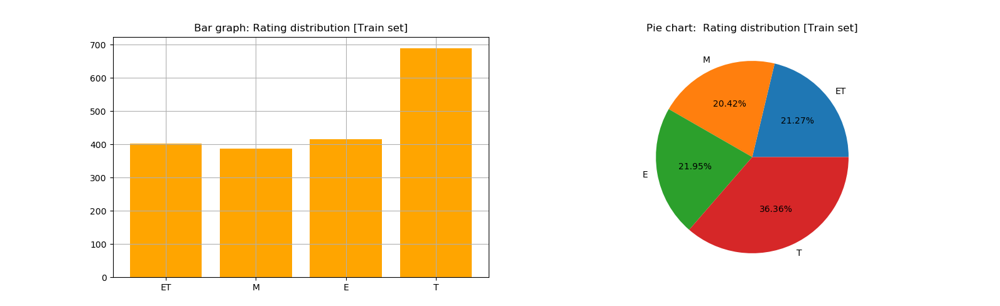
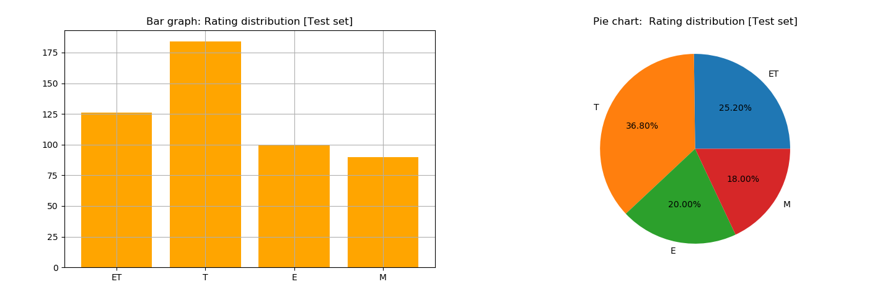
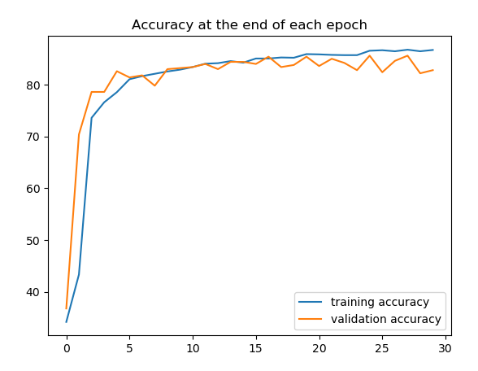
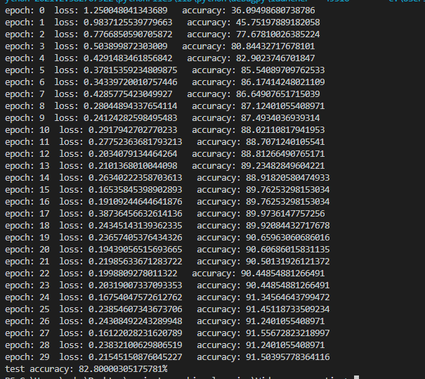

# Pytorch Videogames ESRB Ratings

## Dataset
Pytorch neural network trained on guessing the esrb rating on games.

Dataset can be found on: https://www.kaggle.com/imohtn/video-games-rating-by-esrb/notebooks

The data has 32 values for each game and the rating which is spread across 4 categories: E, ET, M, T.

The train set contains 1895 unique games:

And the test set contains 500 games:

## Model

The model has 2 hidden layers:
1. 1st hidden layer has 128 neurons
2. 2nd hidden layer has 512 neurons

## Training

After training for about 30 epochs in batch sizes of 200 the accuracy stabilizes at arround 91%. Any more than that and it just goes back and forth between 91% and 92%.

Best accuracy I got on the test set was 86%.

<pre>                       </pre>
